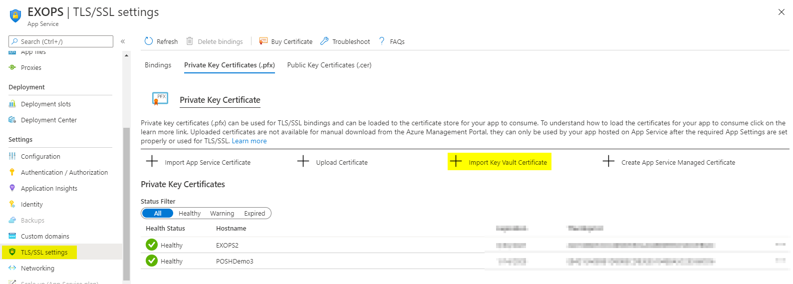

# EXOAzureFunction
Sample Timer Trigger Azure function using the Exchange Online V2 PowerShell module and unattended authentiction.

EXOFunction.ps1 is a example code for using unattended authentication with the Exchange Online V2 module in an Azure function.

# Azure Function App Requirements

This is example requires that PowerShell 7 is selected as the Runtime for the Azure Function

# Authentication Requirements

This example leverages an App Registration that has been configured to use a certificate for Authentication. A great way to generate this certificate is using an Azure Key Vault - https://docs.microsoft.com/en-us/azure/key-vault/certificates/certificate-scenarios. The certificate can be self-signed.

Key Vault certificates can be imported directly into the app service for your Azure Function:

The public key for the certificate can be downloaded as a .cer file to be used in an Azure AD App Registration. The complete steps for configuring the Service Principal can be found here: https://docs.microsoft.com/en-us/powershell/exchange/app-only-auth-powershell-v2?view=exchange-ps

# Azure Function App Configuration

Several configuration items must be added to your Azure Function configuration to ensure the function will have access to required information. The following items need to be added:

    WEBSITE_LOAD_CERTIFICATES : The value of this item is the Thumbprint of the certifacte that was imported into the App Service.
    AuthCertThumbprint : This should be the thumbprint value for the certificate that will authenticate to Exchange Online (In almost all cases will the same value as WEBSITE_LOAD_CERTIFICATES)
    ClientID : The value of this item is the ClientID/Application ID from your Azure AD App Registration
    TenantName : The value of this item is the *.onmicrosoft.com domain for your tenant

# Add Exchange Online Management Module to Function

Dependancy Management can be used to ensure the Exchange Online Management module is available to your function. This can be done by adding the Preview version of the module using the requirements.psd1 file. More information can be found here: https://docs.microsoft.com/en-us/azure/azure-functions/functions-reference-powershell?tabs=portal#dependency-management

Here is an example requirements.psd1 file:

    @{
        'Az' = '4.*';
        'ExchangeOnlineManagement' = '2.0.4-Preview2'
    }

